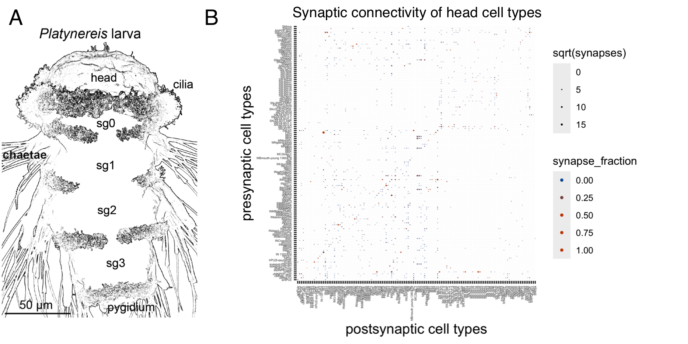

```{r setup, include=FALSE}
knitr::opts_chunk$set(echo = TRUE)
```

## R Markdown

This is an R Markdown document. Markdown is a simple formatting syntax for authoring HTML, PDF, and MS Word documents. For more details on using R Markdown see <http://rmarkdown.rstudio.com>.

**text in bold** 
*italic* 
[underline]{.ul}

## Introduction

You can add references either by referring to their id in the .bib file e.g., [@Marinkovi2020], or by switching to the visual editor (Cogwheel in the .Rmd menu -\> Use Visual Editor).

In the visual editor mode, go to 'Insert' -\> @ Citation

You can select a Zotero library, PubMed, CrossRef etc. and insert the citations.

*Platynereis dumerilii* is a marine annelid... [@ozpolat2021]

The references are stored in text/references.bib (defined in the Yaml header). This file will automatically beupdated when you insert a new reference.

In this documents, references will be formatted in the style of eLife. This is defined in the Yaml header under: csl: elife.csl.

If you would like to use a different format, download the .csl file (e.g., from the Zotero style repository <https://www.zotero.org/styles>), save it in the /text folder of the project and change the Yaml to csl: your_favourite_journal.csl.

## Results

Inserting Figures

You can add your figures into the rendered document (to define the path, go up one dir from /text and go into /figures):

{width="80%"}

Equations can also be inserted, Insert -\> Display Math:

$$
\bar{X} = \frac{\sum_{i=1}^{n} x_{i}}{n}
$$

## Materials and Methods

## Acknowledgements

We would like to thank the Jekely lab for the R project template (<https://github.com/JekelyLab/new_paper_template>) we used to write this paper. This work was funded by ...

## References {.unnumbered}

::: {#refs}
:::
